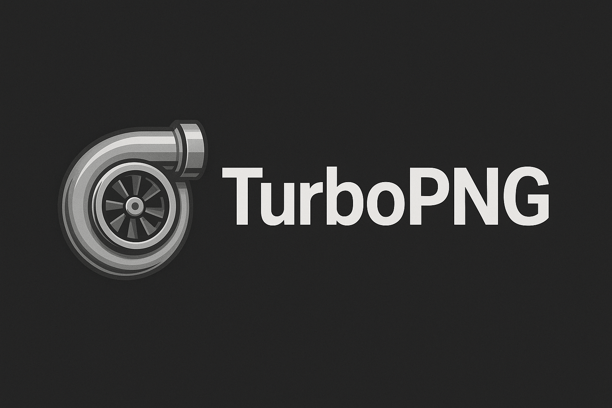

# TurboPNG



TurboPNG is a high-performance Rust CLI for lossless optimization and size-focused PNG compression.

> Built after I got tired of uploading ChatGPT-generated PNGs to random compression websites, this CLI handles lossless and size-focused compression for those bloated outputs.

## Quick Start

```bash
turbo-png path/to/image.png
```

The default `optimize` mode keeps pixels identical while writing a new file next to the source (for example `image_optimized.png`).

## Features

- Two modes:
  - `optimize`: maximally lossless transformation (metadata stripping, chunk reordering, DEFLATE refinement).
  - `compress`: aggressive palette squeezing (≤32 colors by default) with filterless Zopfli for graphics; `--quality 98` unlocks a photo-friendly palette + adaptive filters.
- Multi-file and directory processing with automatic recursion and deduplication.
- Indicatif-based progress UI with optional quiet logging.
- Chunk and metadata retention controls (`--keep-metadata`).
- Atomic writes with `_optimized.png` / `_compressed.png` suffixes.
- Dry-run summaries without touching disk.

## Requirements

- Rust 1.91+ (tracked via `rust-toolchain.toml`).
- libclang toolchain (for `imagequant`, pulled automatically via Cargo).

## Installation

### Prebuilt binaries (recommended)

1. Visit the [latest GitHub release](https://github.com/eddmann/turbo-png/releases) and download the archive that matches your platform. Release files follow the pattern `turbo-png-vX.Y.Z-<platform>.tar.gz` (for example `macos-aarch64`, `linux-x86_64`, or `windows-x86_64`).
2. Extract the archive:

   - macOS / Linux:

     ```bash
     tar -xzf turbo-png-vX.Y.Z-macos-aarch64.tar.gz
     ```

   - Windows (PowerShell):

     ```powershell
     tar -xf .\turbo-png-vX.Y.Z-windows-x86_64.tar.gz
     ```

3. Move the `turbo-png` binary (or `turbo-png.exe` on Windows) somewhere on your `PATH`, such as `/usr/local/bin`, `~/bin`, or `%USERPROFILE%\AppData\Local\Microsoft\WindowsApps`.
4. Confirm everything works:

   ```bash
   turbo-png --version
   ```

> **macOS Gatekeeper tip:** If macOS reports that `turbo-png` is from an unidentified developer, right-click the binary in Finder, choose **Open**, and confirm. Alternatively, remove the quarantine attribute:
>
> ```bash
> sudo xattr -dr com.apple.quarantine /path/to/turbo-png
> ```

### Install with Cargo

If you prefer to build from source or need the latest commit:

```bash
cargo install --git https://github.com/eddmann/turbo-png.git --locked
```

### Build locally (development workflow)

```bash
git clone https://github.com/eddmann/turbo-png.git
cd turbo-png
cargo build --release
```

The compiled binary will be at `target/release/turbo-png`.

## Usage

```bash
turbo-png [OPTIONS] <PATH>...
```

> Working on the project locally? Use `cargo run --release --` as a drop-in replacement for `turbo-png` in the examples below.

### Global Options

| Flag                          | Description                                                            |
| ----------------------------- | ---------------------------------------------------------------------- |
| `--mode <optimize\|compress>` | Select processing pipeline (default: `optimize`).                      |
| `--keep-metadata`             | Preserve all ancillary chunks instead of stripping safe-only metadata. |
| `--overwrite`                 | Replace existing `_optimized.png` / `_compressed.png` outputs.         |
| `--threads <N>`               | Limit Rayon worker threads (defaults to logical CPU count).            |
| `--no-progress`               | Disable the Indicatif UI and emit plain log lines instead.             |
| `--dry-run`                   | Run the full pipeline without writing any files.                       |
| `--zopfli`                    | Force exhaustive Zopfli DEFLATE even in optimize mode.                 |

### Optimize Mode (Lossless)

Delivers the tightest lossless PNG possible. Enable Zopfli for extra squeeze:

```bash
turbo-png --mode optimize --zopfli assets/logo.png
```

Creates `assets/logo_optimized.png` with identical pixels and improved size.

### Compress Mode (Graphics-Focused)

Aims for the smallest PNGs on flat artwork by quantizing to a tight palette (typically ≤32 colors), disabling PNG filtering, and recompressing with Zopfli. Tune quality (1–100, default 90):

```bash
turbo-png --mode compress --quality 70 screenshots/*.png
```

Outputs `*_compressed.png`, reporting palette size, savings %, and runtime.

> Quality controls the palette cap (roughly 12–48 colors) and dithering strength. `--quality 98` activates a photo-friendly preset (≈96 colors + adaptive filters) for smoother gradients and photographic content.

**Mode-specific flag**

- `--quality <LEVEL>`: Palette quantization quality (1–100, default `90`).

## Default Behavior

### Metadata retention

TurboPNG mirrors oxipng’s `--strip safe` policy, keeping display-critical metadata while removing unneeded ancillary chunks. Use `--keep-metadata` to preserve everything:

```bash
# Preserve all metadata verbatim
turbo-png --keep-metadata image.png

# Default behavior keeps ICC profiles, color space, and APNG animation data.
```

### Progress UI

The CLI renders a per-file spinner, an overall progress bar, and a summary line with original size, optimized size, savings, and runtime. Toggle quiet mode with `--no-progress` when running in CI.

## License

TurboPNG relies on `imagequant`, which is dual-licensed for GPL/commercial use. Consult upstream licensing before redistributing binaries. All additional project code is released under MIT unless otherwise noted.
